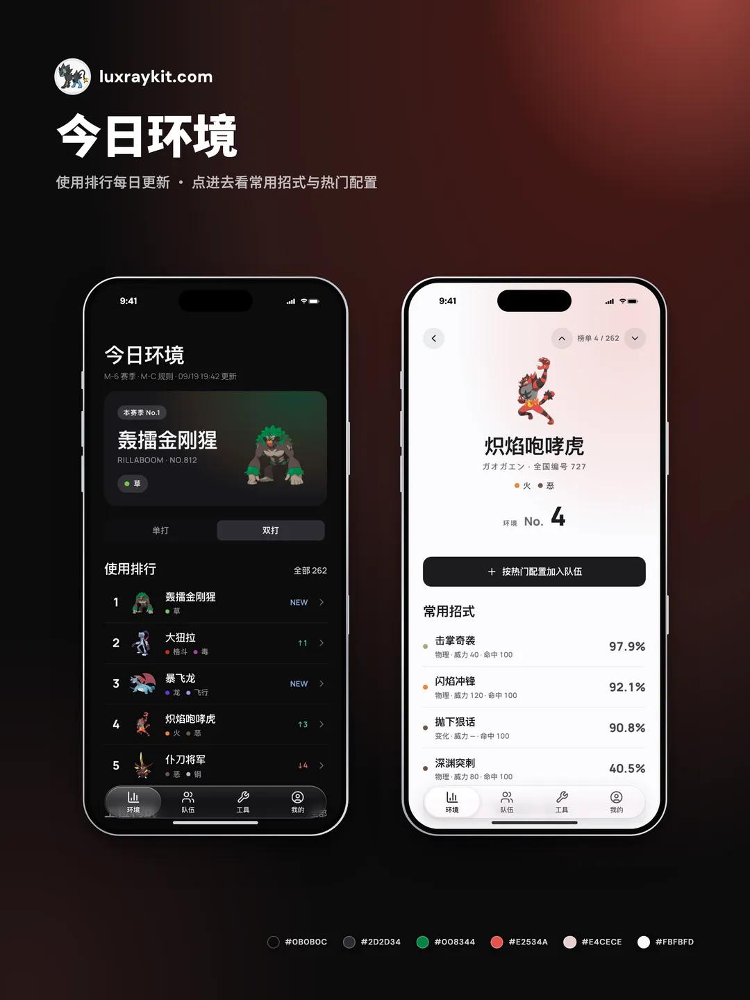
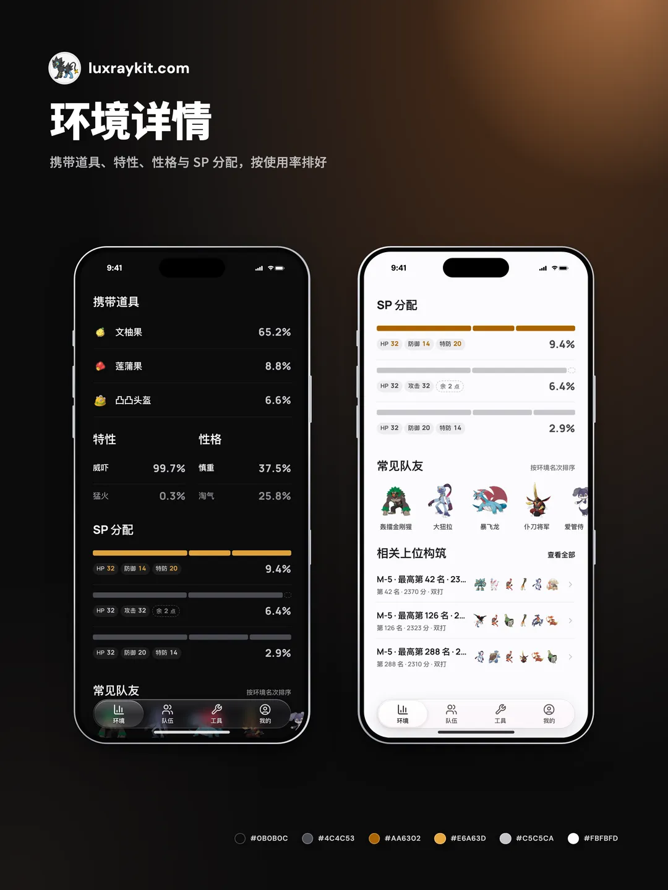
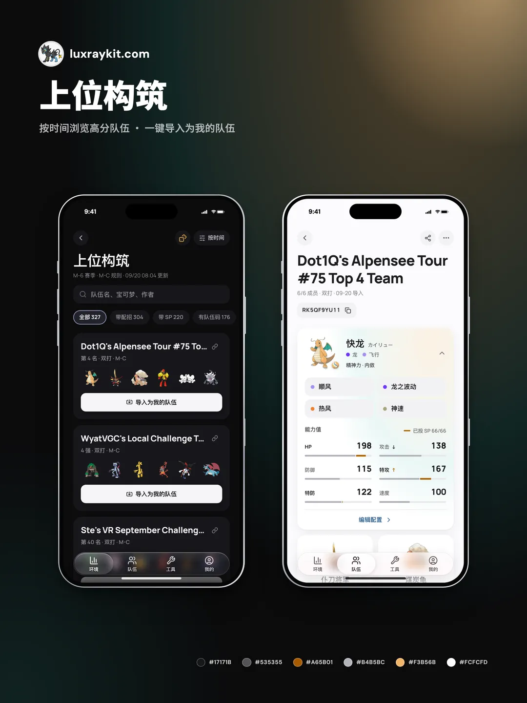
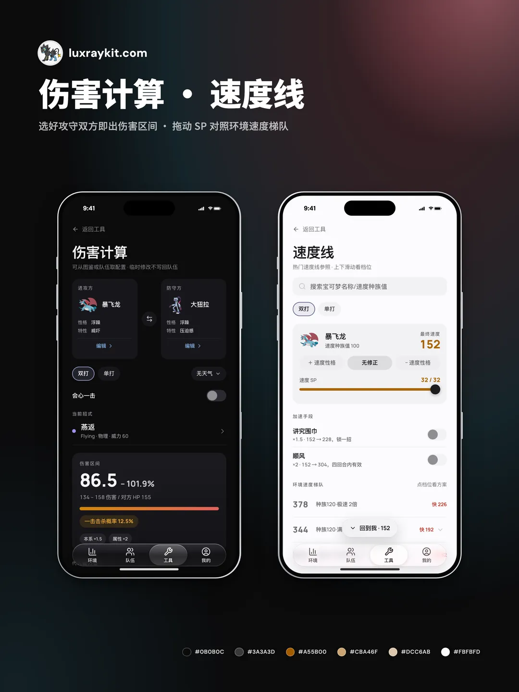
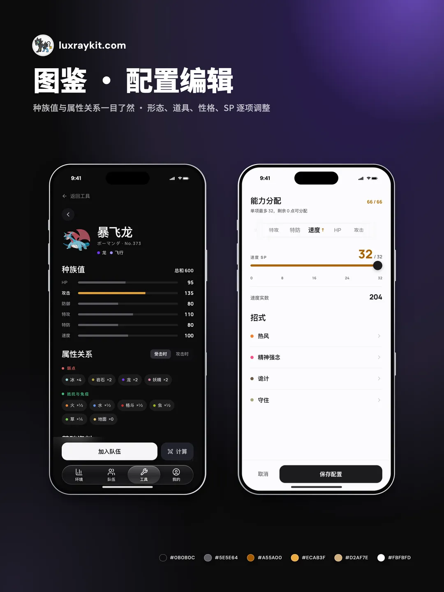

<div align="center">


# Luxray Kit

**宝可梦 Champions 对战伴侣 · 非官方粉丝工具 · 移动端优先 PWA**

[](https://luxraykit.com)
[](./LICENSE)
[](#pwa)

</div>

Luxray Kit 面向 Pokémon Champions 玩家：看**当前规则**下的环境、抄上位构筑、在本地管理自己的队伍；速度线、伤害计算、规则内图鉴和属性速查作为辅助工具。无需账号，数据存在自己设备上。

当前规则与赛季不写死在任何地方：规则窗口以 [`src/data/schedule.ts`](./src/data/schedule.ts) 为准，生效规则见 [`metadata.ts`](./src/data/seed/regMA/metadata.ts) 的 `currentRuleSet`，赛季标签以 PokeDB 每日快照为准；应用页头直接显示「赛季 · 规则」。

> 正式地址：**[luxraykit.com](https://luxraykit.com)**。项目仍在持续开发；环境统计会标注来源与口径，伤害计算为实验性近似，均不构成官方结论或赛事依据。

<table>
  <tr>
    <td width="33%"></td>
    <td width="33%"></td>
    <td width="33%"></td>
  </tr>
  <tr>
    <td width="33%"></td>
    <td width="33%"></td>
    <td width="33%"></td>
  </tr>
</table>

## 功能

### 环境

- **今日环境**：单打 / 双打切换，本赛季 No.1 头图、使用排行 Top 5 与最新上位构筑
- **使用排行**：完整榜单、搜索、第一～第四梯队分层，对比上次更新的名次变化（NEW / ↑n / ↓n）
- **宝可梦详情**：常用招式、携带道具、特性、性格、SP 分配、常见队友、相关上位构筑；上一名 / 下一名翻页；「按热门配置加入队伍」一键带入
- **数据口径**：只给名次、不给百分比，明确「这不是官方使用率」；离线、数据源异常、可能过期、规则刚切换等状态都会在页面上提示

### 上位构筑

- 来源为 PokeDB 排位队报 + VGCPastes Champions 锦标赛构筑，按环境页的单打 / 双打筛选
- 筛选「带配招 / 带 SP / 有队伍码」，按时间或分数排序，按队伍名、宝可梦、作者搜索
- 「随机一队」随机抽一支看看；导入前确认弹窗会列出能带入的内容与缺失项

### 队伍

- 本地队伍新建 / 重命名 / 复制 / 删除 / 移至首位；空状态可粘贴分享链接、从上位构筑抄一套或从空白开始
- 成员编辑：换宝可梦、形态（Mega 自动配石头）、道具、特性、性格、4 招式（环境常用优先）、SP；道具冲突时自动转移并可撤销
- 从成员一键跳到**速度线 / 伤害计算**并代入当前配置
- 不合规项提示；导入队伍自带的队伍码可复制
- **分享链接** `#/t/<code>`：满 6 只且全部合规即可分享（系统分享面板或复制链接）；对方打开先看预览，跨规则失效的配置逐条列出后再决定是否导入

### 工具

- **速度线**：自己的宝可梦入轴，调性格 / SP / 围巾 / 顺风 / 速度特性实时看快慢；纵轴是 PokeDB 环境速度梯队，点任一档给出「超速方案」（最小 SP + 满速兜底，围巾建议受环境携带率门控）
- **伤害计算**：攻防双方可从环境常用、规则内图鉴或自己的队伍选取；单双打、天气、会心、伤害区间
- **规则内图鉴**：宝可梦 / 招式 / 道具 / 特性，属性与分类筛选，宝可梦详情含属性关系与可学会招式
- **属性速查**：单属性 / 双属性 / 18×18 完整矩阵，矩阵支持键盘导航

工具是验证思路的辅助能力，不是主流程；伤害计算不会扩展成战斗流程模拟器（见 [产品边界](./docs/product/PRODUCT_SCOPE_AND_TOOL_BOUNDARIES.md)）。

### 我的

- 深色 / 浅色主题；匿名使用统计开关（默认开启，只记录页面路由、是否 PWA、主题与地区，无 cookie 与标识符）
- 本地备份导出 / 导入（队伍 + 偏好的完整 JSON）、离线缓存状态、添加到主屏幕指引
- **站内留言**：不需要 GitHub 账号，留言不公开，自动附带页面、构建与数据版本
- 当前规则、关于与数据（版本信息一键复制）、清除本地数据

## PWA

| 特性 | 说明 |
| --- | --- |
| 移动端优先 | 底部 Tab 导航，页面密度按手机设计，最大宽度约 430px |
| 安装到主屏幕 | iOS Safari：分享 →「添加到主屏幕」；Android Chrome：菜单 →「安装应用」 |
| 离线可用 | 每次构建预缓存全部资源；环境快照与图片走缓存并后台刷新 |
| 可控更新 | 新版本下载完成后提示「新版本已下载 · 重载」，由用户决定何时切换 |
| 可深链 / 可返回 | 每个页面都有自己的 URL hash；Android 返回键逐层后退，有未保存的改动会先询问 |
| 本地持久化 | 队伍、收藏与设置存 IndexedDB，不依赖账号 |
| 静态部署友好 | 构建产物是纯静态文件，脱离 Worker 也能托管（仅失去在线刷新） |

## 数据来源与限制

| 数据 | 状态 | 说明 |
| --- | --- | --- |
| 规则主数据 | 已接入 | 版本化 seed（版本见 `metadata.ts` 的 `currentDataVersion`；目录名 `seed/regMA/` 为历史遗留，与当前规则无关），来源为官方规则 / allowlist、PokeAPI、PokéBase Champions、社区中文资料与人工复核 |
| 环境快照 | 已接入 | Cloudflare Worker 抓取 PokeDB 最新赛季统计：每日 5 个定点探针（聚集在 PokeDB 发布窗口附近）+ 内容签名（赛季 + 更新日）门控，源变化时才重拉；详细统计覆盖前 60 名 |
| 上位构筑 | 已接入 | PokeDB trainer/list 真实队报 + 脚本摄入的 VGCPastes Champions 锦标赛构筑（M-B、M-C） |
| 速度梯队 | 已接入 | 脚本抓 PokeDB 速度表生成静态快照 `src/data/speedTiers.ts`，规则或环境变化时重跑 |
| 速度计算 | 已接入 | Champions SP 口径：`floor((种族速 + SP + 20) × 性格修正)`，叠加围巾 ×1.5 / 速度特性 ×2 / 顺风 ×2 |
| 伤害计算 | 实验性近似 | `@smogon/calc` Gen9 公式近似，代入 Champions 招式参数与 SP 能力值；天气、场地等以手动选择为准 |
| 合法性与机制 | 非权威 | 伤害、合法性与未确认机制不应视为官方 Champions 结论 |

环境数据入库前经 `src/lib/environmentDataset.ts` 审计：未知的宝可梦 / 招式 / 道具引用会被报告并从 UI 数据中剔除。

## 本地开发

需要 **Node 24**。开发服务器绑定 `127.0.0.1`，建议用手机或浏览器移动端模拟调试。

```bash
npm install
npm run dev        # 开发服务器（不注册 Service Worker）
npm run build      # tsc -b 全量类型检查 + 生产构建到 dist/
npm test           # Vitest 单元 / 组件测试
npm run test:pwa   # Playwright PWA / 离线测试（本机 Chrome）
```

- **部署**：线上是单一 Cloudflare Worker（`luxraykit-app`），托管 `dist/`、`/api/*` 与 PokeDB 刷新 cron；合并进 `main` 由 Workers Builds 自动上线。
- **视觉回归是 CI-only**：基线在 Linux 容器生成，macOS 本机产不出；PR 上 `visual` job 为阻塞门禁，重建用 `gh workflow run visual-baseline.yml --ref "$(git branch --show-current)"`。详见 [`MOBILE_VISUAL_REGRESSION.md`](./docs/qa/MOBILE_VISUAL_REGRESSION.md)。
- **数据维护**：`npm run data:pokedb:environment`、`data:pokedb:speed`、`data:vgcpastes:champions-mc` 等（完整列表见 `package.json`）。生成产物改脚本重新生成，不手改。
- 架构、数据流、Worker 管线与脚本说明见 [开发指南](./docs/DEVELOPER_GUIDE.md)；设计规范见 [设计系统](./docs/DESIGN_SYSTEM.md)。

> 改动没生效？以前装过的 Service Worker 或 `npm run preview` 可能给出旧资源，在 DevTools → Application → Service Workers 注销后硬刷新。

## 参与贡献

提交前请阅读 [`CONTRIBUTING.md`](./CONTRIBUTING.md)：PR 至少通过 `npm test`，涉及前端行为还需通过 `npm run build`。安全漏洞请按 [`SECURITY.md`](./SECURITY.md) 私下报告，不要先开公开 Issue。

## 技术栈

React · Vite · TypeScript · Tailwind CSS · IndexedDB · 手写 Manifest + Service Worker · Cloudflare Workers（Durable Object alarm 分步刷新）· `@smogon/calc` · Vitest · Playwright

## 路线图

- [ ] 队报链接重做 + 双来源统一（指向有实际加点的落点）
- [ ] 完善 `luxraykit.com` 的 SEO、Open Graph 与社媒分享预览
- [ ] 支持 Regulation Set 多版本切换
- [ ] 保持工具页稳定可用，不把伤害计算扩展成战斗流程模拟器

## 免责声明

Luxray Kit 是一个非官方粉丝制作工具。

本项目与任天堂株式会社、株式会社宝可梦、株式会社 Game Freak、株式会社 Creatures、The Pokémon Company International 及其关联方均无任何关联、授权或认可关系。

“Pokémon”“宝可梦”“ポケモン”“Luxray”及相关名称、角色、图像、商标和素材均为其各自权利方所有。本项目仅供个人学习、研究与粉丝交流，不以任何形式声称官方身份或授权关系。

本工具提供的数据、统计和计算结果基于公开资料、第三方开放数据、社区资料与本地整理。由于 Pokémon Champions 机制仍存在未确认部分，所有计算结果和数据展示均不构成正式对战建议。请以游戏内与官方发布的信息为准。

如有版权或商标方面的问题，请通过 [GitHub Issues](https://github.com/ffkiyo7/LuxrayKit/issues) 联系作者。

## License

Luxray Kit 的原创代码与原创文档采用 [MIT License](./LICENSE)。选择 MIT 是为了允许个人和社区自由使用、修改与分发代码，只要求保留版权与许可声明。

Pokémon 名称、商标、角色图像、道具图标、第三方数据、社区队伍内容及其他外部来源材料**不因存放在本仓库而获得 MIT 授权**，仍受各自权利方与来源条款约束。来源、适用范围和再分发注意事项见 [`THIRD_PARTY_NOTICES.md`](./THIRD_PARTY_NOTICES.md)。

欢迎 PR 与 Issue。
